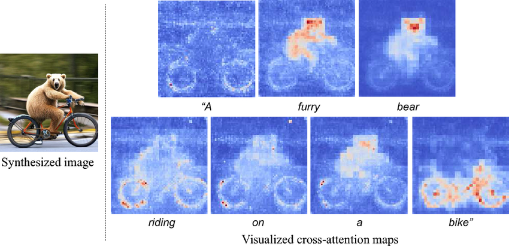

Attention and the Transformer
==============

***by Mike Lawrence***

## Motivation: Sequence Modeling

Goal: Efficiently capture state of the input sequence for downstream modeling.

Examples:
* Language Generation and Translation (Sequence of word tokens)
* Time Series Forecasting (Sequence of temporal observations)
* Computer Vision (Sequence of image patches)

## Background: From RNNs/LSTMs to Transformers

The famous `Attention Is All You Need` paper from Google opened the door for GPU-efficient, high-performing sequence modeling via the Transformer architecture: https://arxiv.org/pdf/1706.03762.pdf

Previous state-of-the-art models, like RNNs and LSTMs, relied on sequential processing of the input sequence (not parallel like attention), had noisy compression of the input state, and high numeric instability. Roughly speaking, Attention performs a weighted transformation to the input sequence by matrix multiplication, while RNN-style architectures do a for-loop over the input sequence and update a shared state each iteration.

Pictured: LSTM architecture (applied iteratively to the sequence)

Pictured: Transformer architecture (encode in bulk, decode iteratively)

**This change is fundamentally possible due to the `attention` mechanism.**

## Attention

### High level: 

Convert a sequence of embeddings into a new sequence of the same length where each converted embedding is a "context vector", containing information about the entire sequence.

Diagram

Each `h` in the stack of attention layers is a "head", thus multi-headed attention. Implementation of Multi-head Attention (MHA) thus only requires building attention once and creating a stack of such layers.

Here's a breakdown of the linear algebra operations involved in building a single attention layer, where `Q`,  `K`, `V` are Queries, Keys, and Values per the original information retrieval context it was written in:

Pictured: The sequence of length `T` and embedding dimension `d` are transformed into a new sequence of shape $(T, d_{v})$ where $d_v$ is a new embedding dimension that we choose.

### Breaking down the diagram

The entire process can be distilled to the equation:

$$C = \text{softmax}(\frac{QK^T}{\sqrt{D_v}}) \times V$$

Where the $\text{softmax}(\frac{QK^T}{\sqrt{D_v}})$ factor is called the `attention matrix` and the entire quantity, `C`, are the context vectors.

### Input Sequence

First, the inputs will be the **ordered** embeddings for the task to transform, such as:

| vocab | dim1 | dim2 | dim3 |
| ----- | ---- | ---- | ---- |
| See   | 0.2  | 0.4  | 0.3  |
| that  | 0.8  | 0.22 | 0.3  |
| cat   | 0.3  | 0.65 | 0.11 |

This $(T, d)$ matrix is the *input sequence*, and the embedding dimension can be of arbitrary length.

Note: The embeddings come from elsewhere. The quality of data representation is completely external to the attention mechanism, though they could be trained together (see pretrain-finetune paradigm on Google).

**Takeaway: We call this $(T, d)$ Input Sequence $X$.**

### Keys, Queries, and Values

The $K$, $Q$, and $V$ matrices are at the core of the context vector calculation. We get them by multiplying the input sequence with the respective weight matrices.

Recall we have the input sequence, $X$:

$$
X:  \text{shape}=(T, D_{input})
$$

Where the sequence length is $T$ (short for time, a sequence modeling convention).

For each of $Q$, $K$, $V$ we have a weight matrix,

$$
W_q:  \text{shape}=(D_{input}, D_{kq})
$$

$$
W_k:  \text{shape}=(D_{input}, D_{kq})
$$

$$
W_v:  \text{shape}=(D_{input}, D_{v})
$$

These are all compatible for multiplication with the input sequence, $T$!

We then create the final  $K$, $Q$, $V$  matrices accordingly. 

$$
Q = X \times W_q: shape = (T, D_{kq})
$$

$$
K = X \times W_k: shape = (T, D_{kq})
$$

$$
V = X \times W_v: shape = (T, D_{v})
$$

where each row, item $i$, corresponds to the same item in the original sequence.

**Takeaway: $Q$, $K$, $V$ are all just 1 matrix multiplication on the input sequence!**

### The Attention Matrix

Let's take a closer look at the "Attention Matrix", $QK^T$. 

Recall that $Q$ and $K$ have an identical shape and initialization pattern. They are both $(T, D_{kq})$ matrices, containing embedding information for each token in the input sequence.

In the attention matrix calculation, $A=\frac{1}{\sqrt{D_v}}QK^T$, we create one $(T, T)$ matrix. How do we interpret these values?

#### Element-wise Interpretation

Each matrix element is a product of the form,

$$
A_{ij} =  \frac{1}{\sqrt{D_v}} Q_i K_j
$$

Recall the shapes of $Q$ and $K$,

$$
Q: shape = (T, D_{kq})
$$

$$
K: shape = (T, D_{kq})
$$

Thus intuitively each element, as a dot product, may be thought of as a similarity measure between the $Q$ embedding and $K$ embedding at every timestamp. 

**Takeaway: a token at time `t` can `attend` to tokens at other parts of the sequence. Attending before `t` looks into the past, while after `t` is the future of the sequence.**

#### Causality and Masking

It's common to mask attention values to enforce causality or other constraints in the model. For example, when decoding a new sentence, it is not appropriate to allow a token at time `t` to attend to tokens at future times!

You can introduce a mask matrix to null out values that should not be attended to -- this makes the attention weights 0.

Thus the attention calculation may look something like,

$$
A_{ij} =  \frac{1}{\sqrt{D_v}} Q_i K_j \delta_{ij}
$$

where $\delta_{ij}$ is the mask value. This can be $(0, 1)$ after the softmax step or $(0,  -\infty)$ before softmax for more efficient normalization.

**Takeaway: You can modify attention with a mask to exclude items in the sequence, such as for preserving causality.**

#### Example

Consider the sequence `['attention', 'is', 'cool']`. Each has an associated embedding in the input sequence, which get turned into queries and keys in the matrix multiplication step, `Q = [query0, query1, query2]` and `K = [key0, key1, key2]`.

The attention matrix, $A$, is easily represented as pairs of similarity calculations across queries and key. Since the sequence order is encoded into the indices, these calculations are comparing token AND temporal information.

$$
A = \frac{1}{\sqrt{D_v}} \begin{pmatrix}
\text{sim}(query0,key0) & \text{sim}(query0,key1) & \text{sim}(query0,key2)\\
\text{sim}(query1,key0) & \text{sim}(query1,key1) & \text{sim}(query1,key2)\\
\text{sim}(query2,key0) & \text{sim}(query2,key1) & \text{sim}(query2,key2)
\end{pmatrix}
$$

In the decoder case similarities with future values in the sequence aren't known and thus should be masked, making a lower triangular matrix. The K and Q for each token are thus compared only to the time steps at or before themselves.

$$
A = \frac{1}{\sqrt{D_v}} \begin{pmatrix}
\text{sim}(query0,key0) & -\infty & -\infty \\
\text{sim}(query1,key0) & \text{sim}(query1,key1) & -\infty\\
\text{sim}(query2,key0) & \text{sim}(query2,key1) & \text{sim}(query2,key2)
\end{pmatrix}
$$

The final attention matrix is often then visualized for feature importance,

Pictured: masked self-attention matrix (unnormalized)

### How Machines Pay Attention: Weights From the Attention Matrix

We stepped through $A=\frac{1}{\sqrt{D_v}}QK^T$, but what we really want is,

$$
\text{weights}_{normalized} = \text{softmax}(\frac{QK^T}{\sqrt{D_v}})
$$

Applying the $\text{softmax}$ on row-by-row basis creates a set of normalized weights for every token in the sequence with respect to every other token in the sequence.

Taking the earlier masked matrix as an example,

$$
\text{softmax}(A) = \text{softmax}(\frac{1}{\sqrt{D_v}} \begin{pmatrix}
\text{sim}(query0,key0) & -\infty & -\infty \\
\text{sim}(query1,key0) & \text{sim}(query1,key1) & -\infty\\
\text{sim}(query2,key0) & \text{sim}(query2,key1) & \text{sim}(query2,key2)
\end{pmatrix})
$$

The softmax of $-\infty$ is 0, so a real set of values may look like,

$$
\text{softmax}(A) = \begin{pmatrix}
1.0 & 0 & 0 \\
0.6 & 0.4 & 0\\
0.2 & 0.5 & 0.3
\end{pmatrix}
$$

Considering again the the sequence this represents, `['attention', 'is', 'cool']`, we interpret these values row-by-row as what that token "attends" to:

- Timestep 0: `attention` -> `attention` (1.0)
- Timestep 1: `is` -> `attention` (0.6), `is` (0.4)
- Timestep 2: `cool` -> `attention` (0.2), `is` (0.5), `cool` (0.3)

**Takeaway: for each time step we learn to weigh previous tokens, including their position information. These weights can be thought of as how much each token in $Q$ pays "attention" to the other tokens from $K$!**

### Combining everything: The final Context Vectors

We built up the pieces to form the context vectors, $C$. The equation we started with is of the form,

$$C = \text{softmax}(\frac{QK^T}{\sqrt{D_v}}) \times V$$

We know the final matrix should be of shape $(T, D_V)$. The softmax term has shape $(T, T)$, while $V$ has shape $(T, D_{v})$

Thus we multiply $(T, T) \times (T, D_{v}) = (T, D_v)$, forming a new embedding of size $(1, D_v)$ for each item in the initial sequence.

The matrix elements can be interpreted like,

$$
C_{ij} = \text{weights}_i V^j
$$

Where $\text{weights}_i$ is the row of time-wise weights at time $i$ and $V^j$ is the `Values` column across time $j$. Thus the weights apply masking forward in time if necessary, and form a new value as a weighted average of all old embeddings across time.

$C_i$, the $ith$ row of the new matrix, is the attention weights for time $i$ applied to all columns of the original `Values`.

Using the old example,

$$
\text{softmax}(A) = \begin{pmatrix}
1.0 & 0 & 0 \\
0.6 & 0.4 & 0\\
0.2 & 0.5 & 0.3
\end{pmatrix}
$$

$$
\text{Values} (D_v=4) = \begin{pmatrix}
0.1 & 0.2 & 0.3 & 0.3\\
0.4 & 0.24 & 0.90 & 0.3\\
0.1 & 0.8 & 0.3 & 0.3
\end{pmatrix}
$$

The first matrix entry of the context vectors is the standard matrix multiplication of these two - the first row of the weights dotted with the first column of the Values.

$$
C_{00} = 1.0 * 0.1 + 0 * 0.4 + 0 * 0.1 = 0.1
$$

Note that in this masked case, the first row of the Values is actually unchanged - the weighted average for the first timestep has no historical values to factor in!

**Takeaway: each new embedding is a weighted average of itself and all other embeddings, where the weights are the attention values!**

## The Transformer

## Self-attention vs Cross-attention

Everything we worked through was an example of *self-attention* -- the $Q$, $K$, $V$ matrices are computed using one input sequence, and resulting calculations attend to other items in this input sequence. This is great for some use cases like encoding the input sequence, but not the only way!

Another important type of attention is *cross-attention*, where we use two input sequences instead of one. What does this look like?

Imagine we are doing a translation task. In this instance there is an encoded input sentence, `inputs 2`, which is used to generates $K$ and $Q$, then `inputs 1` contains the *decoder's* sequence. The resulting attention matrix then calculates attention values between the items in the decoder, or target language, and the encoder, or source language!

Perhaps most miraculous of all is that the sequence representations in both inputs can be from different modalities.

Pictured: Cross attention weights between image patches and language tokens. The heatmap for some words, like furry or bike, produce significant weight in the image patch attention weights!

**Takeaway: Self-attention transforms data in the context of itself. Cross-attention transforms data in the context of outside information.**

## Multi-headed attention

Run attention on the same input data `N` times in parallel. Each of the `N` times is on a separate attention instance with its own weights. Concat the results.

That's it!

## The Transformer

The entire transformer can be decomposed into a series of components that are easily built with knowledge we have now:

The left "tower" in this famous image is an encoder, while the right is a decoder.

### The encoder

 The encoder adds positional information to each token's embedding then runs multi-headed self-attention on the sequence without masking to generate a risk represenation of the encoded sequence. Residual information via skip layers and a MLP with layer normalization perform some basic processing of the transformed embeddings and offer some additional modeling power.

 **Takeaway: Forms a rich representation of context data via self-attention.**

 ### The decoder

 The decoder's role is to generate an output, such as the next word in a sequence. It does this auto-regressively -- each generated output is appended to the input sequence before running again. The input sequence has positional information inserted into it, and causal self-attention is used to enrich the input sequence, then context information from the encoder is attended to in a cross-attention step. Vanilla feed-forward and layer norm steps, followed by a softmax, give a probability over the vocabulary.

 **Takeaway: Uses encoded context data (if available) to generate new outputs via cross-attention.**

# References

TODO: Add sources for all borrow content (images are not mine!)